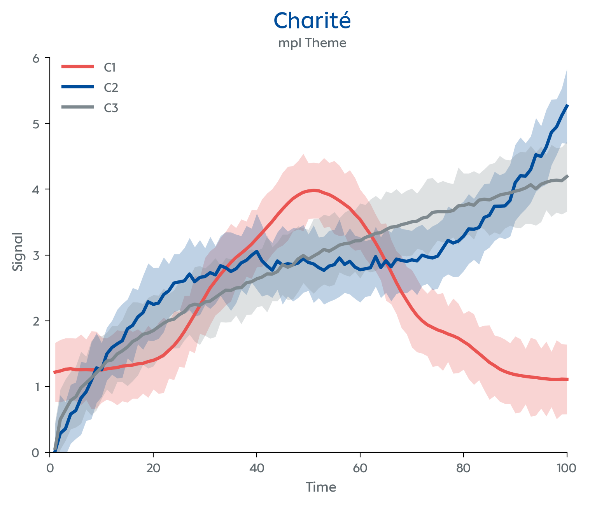
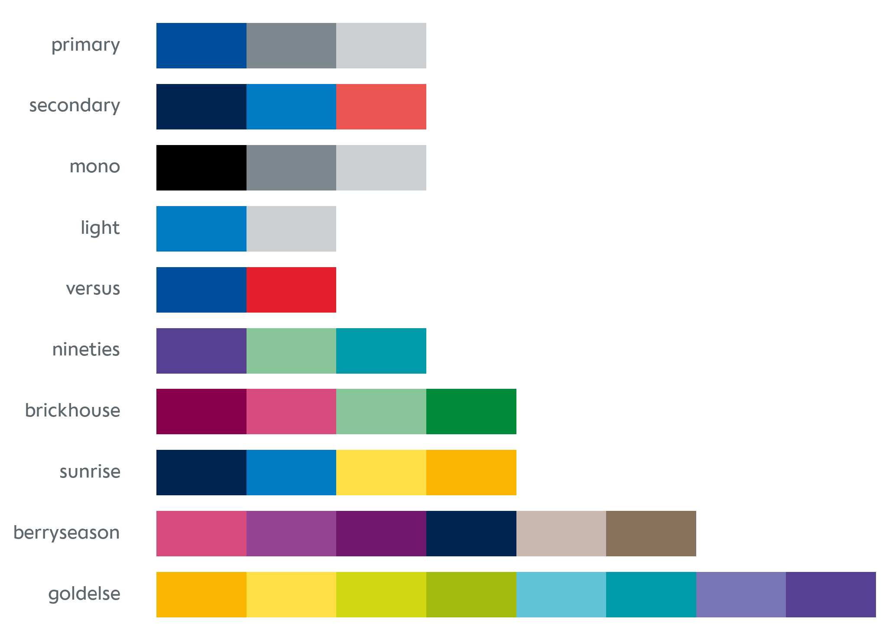

# charite-plot

A Python package with a Charité-styled Matplotlib theme, [visual identity](https://marke.charite.de/d/Y3FxSwD6Tz3a) colour palettes, and an Altair theme — ported from the [`charite` R package](https://github.com/johannesjuliusm/charite).

Visualize your data with `theme_charite()` to match the Charité corporate style.

<p align="center">

</p>

Preview the available colour palettes.

<p align="center">

</p>

---

## Quick start

### Matplotlib

```python
import matplotlib.pyplot as plt
from charite_plot.mpl_themes import theme_charite, apply_theme

apply_theme(theme_charite())

fig, ax = plt.subplots()
ax.plot([1, 2, 3], [4, 7, 3])
ax.set_title("My chart")
plt.show()
```

Use as a context manager to scope the theme to a single figure:

```python
from charite_plot.mpl_themes import theme_charite, using

with using(theme_charite(palette="goldelse")):
    fig, ax = plt.subplots()
    ax.bar(["A", "B", "C"], [3, 7, 5])
```

### Altair

```python
from charite_plot.altair_themes import enable
import altair as alt

enable()

chart = alt.Chart(df).mark_bar().encode(...)
```

---

## Design principles

- **Single source of truth** — colors are defined once in `colors.py` and imported by every other module.
- **No side effects on import** — theme functions return plain dicts; you opt in with `apply_theme()`, `using()`, or `enable()`.
- **Font fallback** — if Charité Text Office is not installed, the theme cascades to Charit? Text Office, then Calibri, DejaVu Sans, and finally sans-serif automatically, following the official brand guidelines.
